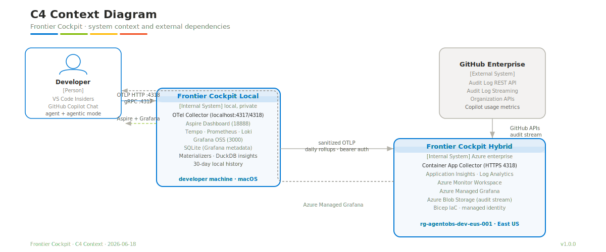
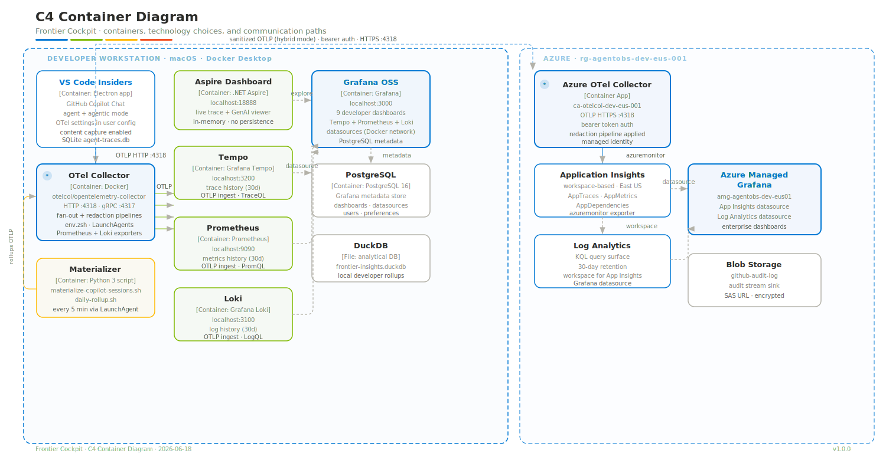
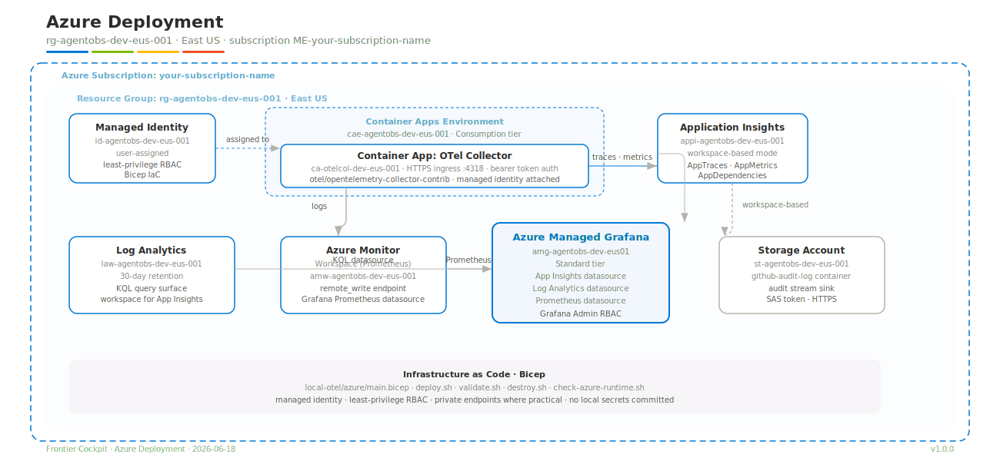
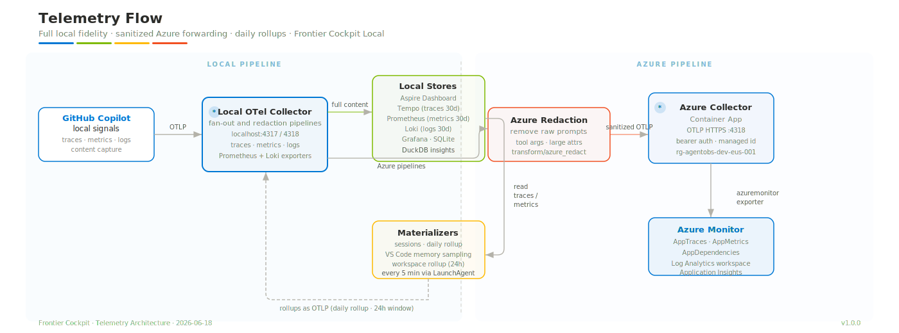
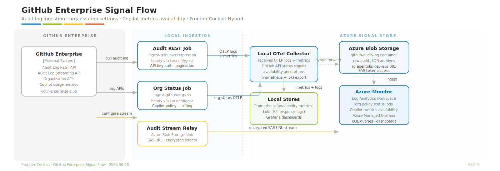
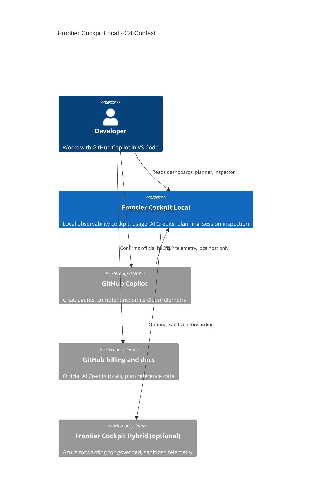
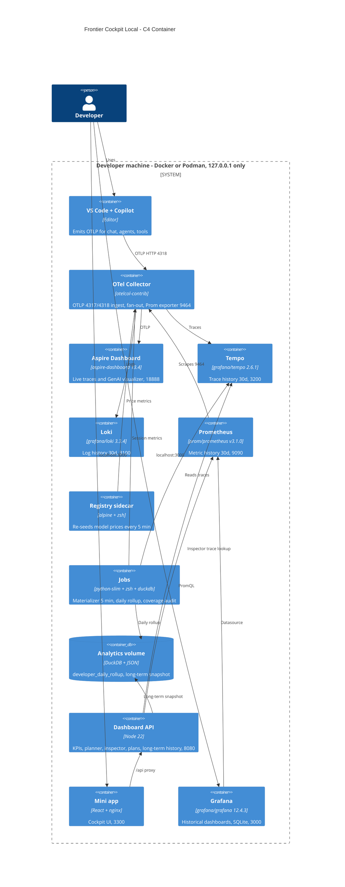
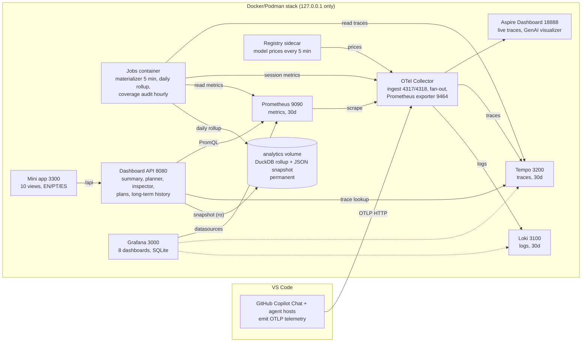
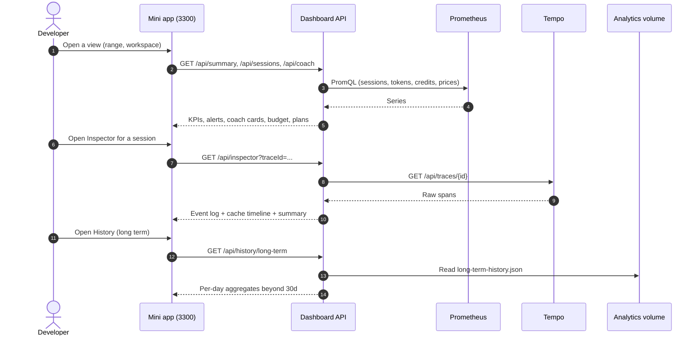
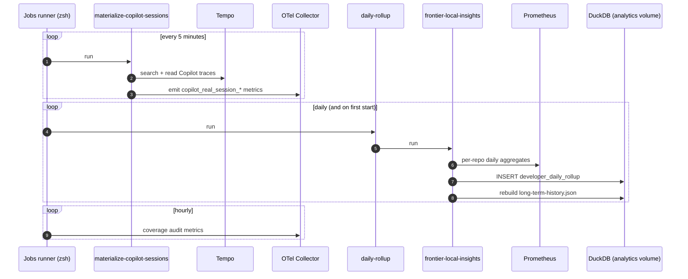

<!-- markdownlint-disable MD025 -->

# Frontier Cockpit Architecture Diagrams

This document indexes the editable and rendered architecture diagrams for Frontier Cockpit Local.

## Change Log

| Version | Date | Author | Changes |
| --- | --- | --- | --- |
| 1.2.0 | 2026-07-03 | Frontier Cockpit Team | Added validated Mermaid-as-code diagrams for the current local solution: refreshed C4 context and container, the complete local architecture with per-component roles, and sequence diagrams for the dashboard request path and the persistence pipeline (DuckDB long-term store). |
| 1.1.0 | 2026-07-02 | Frontier Cockpit Team | Rebrand to Frontier Cockpit Local and Hybrid, repository-relative paths, containerized jobs, privacy-first defaults. |
| 1.0.0 | 2026-06-18 | Frontier Cockpit Team | Initial architecture diagram set. |

## Table of Contents

- [1. Diagram Sources](#1-diagram-sources)
- [2. C4 Context](#2-c4-context)
- [3. C4 Container](#3-c4-container)
- [4. Azure Deployment](#4-azure-deployment)
- [5. Telemetry Flow](#5-telemetry-flow)
- [6. GitHub Enterprise Flow](#6-github-enterprise-flow)
- [7. Diagram Validation](#7-diagram-validation)
- [8. Mermaid Diagrams (Current Local Solution)](#8-mermaid-diagrams-current-local-solution)
- [References](#references)

## 1. Diagram Sources

The editable draw.io source is the source of truth:

[diagrams/FrontierCockpit_Architecture_v1_0_0_2026-06-18.drawio](../diagrams/FrontierCockpit_Architecture_v1_0_0_2026-06-18.drawio)

The `.drawio` file contains five pages:

| Page | Purpose |
| --- | --- |
| C4 Context | Executive context for Frontier Cockpit Local and Frontier Cockpit Hybrid |
| C4 Container | Local and Azure component map |
| Azure Deployment | Azure resources and boundaries |
| Telemetry Flow | Full-fidelity local path and sanitized Azure path |
| GitHub Enterprise Flow | GitHub Enterprise APIs, audit stream, org status, and Azure consolidation |

The diagrams use draw.io Azure and GitHub stencil references where product icons apply. Generic shapes are used only for local processes and conceptual boundaries.

## 2. C4 Context

This diagram shows the main actors, Frontier Cockpit Local, Frontier Cockpit Hybrid, and the GitHub Enterprise API/audit-log source.



## 3. C4 Container

This diagram breaks the system into local runtime containers and Azure runtime services.



## 4. Azure Deployment

This diagram shows the deployed Azure resources in subscription `your-subscription-name`, resource group `rg-agentobs-dev-eus-001`, region `eastus`.



## 5. Telemetry Flow

This diagram shows how local telemetry remains full fidelity while Azure receives sanitized traces, metrics, logs, and daily rollups.



## 6. GitHub Enterprise Flow

This diagram shows how GitHub Enterprise audit log APIs, audit log streaming, organization policy checks, and GitHub Copilot metrics availability flow into Azure.



## 7. Diagram Validation

Validation command:

```bash
python3 .github/skills/azure-architecture-diagrams/scripts/validate_drawio.py \
  frontier-cockpit/diagrams/FrontierCockpit_Architecture_v1_0_0_2026-06-18.drawio \
  --require-icon \
  --require-edge
```

Validation result:

```text
OK: 5 page(s), 51 vertex node(s), 42 edge(s), 44 icon/generic node style(s)
```

SVG export command pattern:

```bash
drawio -x -f svg --embed-svg-images --embed-svg-fonts true -p <page> -o <output.svg> \
  frontier-cockpit/diagrams/FrontierCockpit_Architecture_v1_0_0_2026-06-18.drawio
```

## 8. Mermaid Diagrams (Current Local Solution)

The diagrams below are the up-to-date view of the local solution as code. Each block renders natively on GitHub, the sources live in [diagrams/mermaid/](../diagrams/mermaid/), and every diagram is parse-validated with the Mermaid parser before it lands. When the stack changes, update these first; the draw.io set in section 1 remains for the Azure/Hybrid material.

### 8.1 C4 Context



### 8.2 C4 Container



### 8.3 Complete Local Architecture and Data Flow

What each component does: the **OTel Collector** is the single ingest door (OTLP 4317/4318) and fans out to every backend while exposing metrics on 9464 for Prometheus to scrape. **Aspire Dashboard** is the live view; **Tempo/Loki/Prometheus** keep 30 days of traces/logs/metrics in Docker volumes. The **registry sidecar** republishes model prices every 5 minutes so cost estimates never expire. The **jobs container** materializes Copilot sessions from Tempo into Prometheus metrics every 5 minutes, runs the coverage audit hourly, and once a day persists per-repo aggregates into **DuckDB** in the permanent `analytics` volume, rebuilding the JSON snapshot. The **Dashboard API** computes every KPI, alert, coach card, planner forecast, and inspector timeline from those stores, and the **mini app** renders them in EN/PT-BR/ES. **Grafana** serves the 8 provisioned historical dashboards from its embedded SQLite.



### 8.4 Sequence: Dashboard Request Path



### 8.5 Sequence: Scheduled Jobs and Long-Term Persistence



## References

- [Azure architecture icons](https://learn.microsoft.com/azure/architecture/icons/)
- [GitHub Octicons](https://primer.style/octicons/)
- [Draw.io XML and mxGraph format](https://www.drawio.com/doc/faq/format-of-files)
- [Draw.io Azure shapes](https://www.drawio.com/doc/faq/shapes-azure)
- [C4 model](https://c4model.com/)
